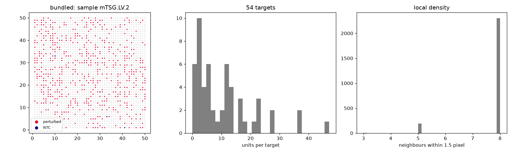

# Audit: bundled

Generated by scripts/audit_datasets.py (Perturb-DBiT, units: pixel).

| metric | value |
|---|---|
| n_units | 2500 |
| n_features | 300 |
| n_samples | 1 |
| guide_call_rate | 0.2312 |
| n_perturbed | 574 |
| n_ntc | 4 |
| n_ntc_guides | 2 |
| n_targets | 52 |

## Neighbour graphs and clonality

| graph | mean degree | isolated | median edge | same-target edges obs | null mean (sd) | z |
|---|---|---|---|---|---|---|
| delaunay_pruned | 5.84 | 0.000 | 1.0 | 12 | 12.9 (3.8) | -0.2 |
| radius | 7.76 | 0.000 | 1.0 | 16 | 17.1 (4.1) | -0.3 |
| knn10 | 8.08 | 0.000 | 1.4 | 17 | 18.2 (5.2) | -0.2 |

Local density (neighbours within 1.5 pixel): perturbed 7.7543554006968645, NTC 7.25, unassigned 7.76.

