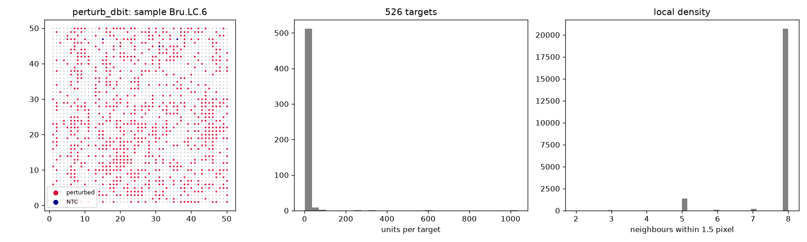

# Audit: perturb_dbit

Generated by scripts/audit_datasets.py (Perturb-DBiT, units: pixel).

| metric | value |
|---|---|
| n_units | 22421 |
| n_features | 181749 |
| n_samples | 6 |
| guide_call_rate | 0.2165 |
| n_perturbed | 4831 |
| n_ntc | 23 |
| n_ntc_guides | 14 |
| n_targets | 526 |

## Neighbour graphs and clonality

| graph | mean degree | isolated | median edge | same-target edges obs | null mean (sd) | z |
|---|---|---|---|---|---|---|
| delaunay_pruned | 5.87 | 0.000 | 1.0 | 2734 | 1866.6 (34.1) | 25.4 |
| radius | 7.79 | 0.000 | 1.0 | 3599 | 2464.8 (34.6) | 32.8 |
| knn8 | 8.08 | 0.000 | 1.4 | 3810 | 2640.1 (35.6) | 32.9 |

Local density (neighbours within 1.5 pixel): perturbed 7.735044504243428, NTC 7.826086956521739, unassigned 7.81.

