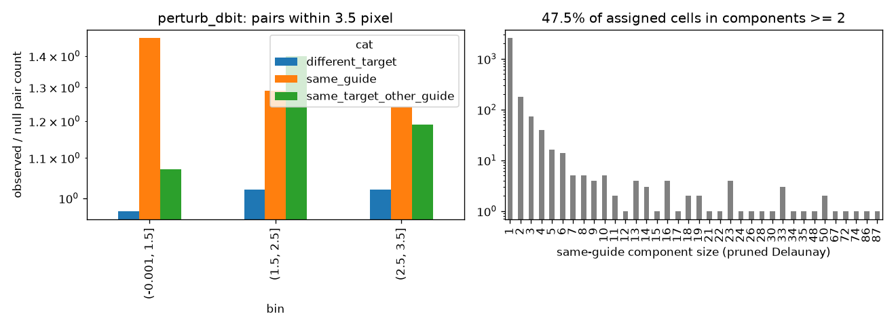

# Same-target clustering: perturb_dbit

Exploratory (not pre-registered). Generated by scripts/clonality_analysis.py.

## Observed / null pair counts by distance bin

| bin           |   different_target |   same_guide |   same_target_other_guide |
|:--------------|-------------------:|-------------:|--------------------------:|
| (-0.001, 1.5] |               0.97 |         1.46 |                      1.07 |
| (1.5, 2.5]    |               1.02 |         1.29 |                      1.4  |
| (2.5, 3.5]    |               1.02 |         1.24 |                      1.19 |

## Same-guide connected components (pruned Delaunay): 47.5% of assigned cells in components of size >= 2

|              |    1 |   2 |   3 |   4 |   5 |   6 |   7 |   8 |   9 |   10 |   11 |   12 |   13 |   14 |   15 |   16 |   17 |   18 |   19 |   21 |   22 |   23 |   24 |   26 |   28 |   30 |   33 |   34 |   35 |   48 |   50 |   67 |   72 |   74 |   86 |   87 |
|:-------------|-----:|----:|----:|----:|----:|----:|----:|----:|----:|-----:|-----:|-----:|-----:|-----:|-----:|-----:|-----:|-----:|-----:|-----:|-----:|-----:|-----:|-----:|-----:|-----:|-----:|-----:|-----:|-----:|-----:|-----:|-----:|-----:|-----:|-----:|
| n_components | 2550 | 177 |  74 |  40 |  16 |  14 |   5 |   5 |   4 |    5 |    2 |    1 |    4 |    3 |    1 |    4 |    1 |    2 |    2 |    1 |    1 |    4 |    1 |    1 |    1 |    1 |    3 |    1 |    1 |    1 |    2 |    1 |    1 |    1 |    1 |    1 |

## Misassignment signature: {"median_cor": 0.9935956510641472, "n_targets": 20, "frac_cor_above_0.3": 1.0}

