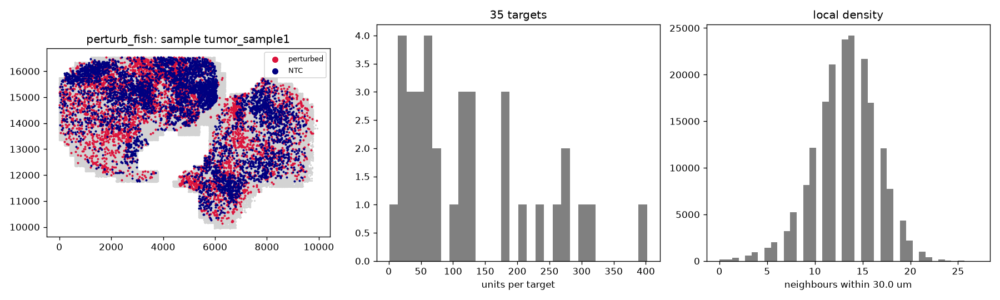

# Audit: perturb_fish

Generated by scripts/audit_datasets.py (Perturb-FISH (MERFISH), units: um).

| metric | value |
|---|---|
| n_units | 187215 |
| n_features | 500 |
| n_samples | 1 |
| guide_call_rate | 0.0517 |
| n_perturbed | 4387 |
| n_ntc | 4987 |
| n_ntc_guides | 4 |
| n_targets | 35 |

## Neighbour graphs and clonality

| graph | mean degree | isolated | median edge | same-target edges obs | null mean (sd) | z |
|---|---|---|---|---|---|---|
| delaunay_pruned | 5.97 | 0.000 | 15.4 | 223 | 14.6 (3.7) | 56.1 |
| radius | 13.24 | 0.001 | 21.5 | 397 | 33.4 (5.3) | 68.5 |
| knn10 | 11.05 | 0.000 | 19.8 | 354 | 26.6 (4.6) | 70.6 |

Local density (neighbours within 30.0 um): perturbed 12.97674948712104, NTC 13.019250050130339, unassigned 13.26.

