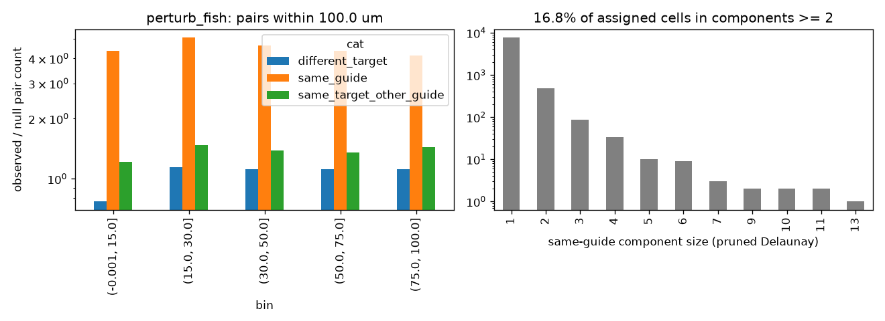

# Same-target clustering: perturb_fish

Exploratory (not pre-registered). Generated by scripts/clonality_analysis.py.

## Observed / null pair counts by distance bin

| bin            |   different_target |   same_guide |   same_target_other_guide |
|:---------------|-------------------:|-------------:|--------------------------:|
| (-0.001, 15.0] |               0.77 |         4.36 |                      1.22 |
| (15.0, 30.0]   |               1.14 |         5.1  |                      1.48 |
| (30.0, 50.0]   |               1.12 |         4.64 |                      1.39 |
| (50.0, 75.0]   |               1.12 |         4.38 |                      1.36 |
| (75.0, 100.0]  |               1.12 |         4.13 |                      1.44 |

## Same-guide connected components (pruned Delaunay): 16.8% of assigned cells in components of size >= 2

|              |    1 |   2 |   3 |   4 |   5 |   6 |   7 |   9 |   10 |   11 |   13 |
|:-------------|-----:|----:|----:|----:|----:|----:|----:|----:|-----:|-----:|-----:|
| n_components | 7800 | 491 |  86 |  34 |  10 |   9 |   3 |   2 |    2 |    2 |    1 |

## Misassignment signature: {"median_cor": 0.7231669204824864, "n_targets": 30, "frac_cor_above_0.3": 1.0}

