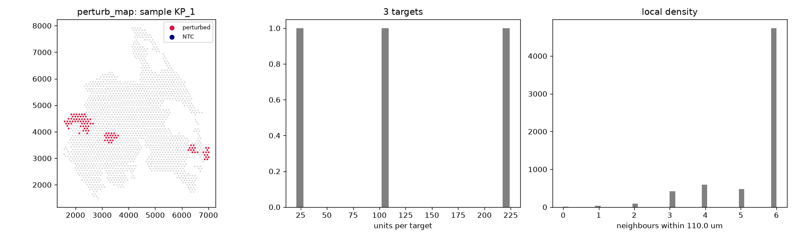

# Audit: perturb_map

Generated by scripts/audit_datasets.py (Perturb-map (Visium), units: um).

| metric | value |
|---|---|
| n_units | 6363 |
| n_features | 32289 |
| n_samples | 4 |
| guide_call_rate | 0.3153 |
| n_perturbed | 350 |
| n_ntc | 0 |
| n_ntc_guides | 0 |
| n_targets | 3 |

## Neighbour graphs and clonality

| graph | mean degree | isolated | median edge | same-target edges obs | null mean (sd) | z |
|---|---|---|---|---|---|---|
| delaunay_pruned | 5.45 | 0.001 | 101.5 | 2627 | 1671.9 (25.4) | 37.7 |
| radius | 5.45 | 0.001 | 101.5 | 2627 | 1672.5 (21.4) | 44.6 |
| knn6 | 6.38 | 0.000 | 102.0 | 2947 | 1886.9 (27.9) | 38.0 |

Local density (neighbours within 110.0 um): perturbed 5.314285714285714, NTC None, unassigned 5.39.

