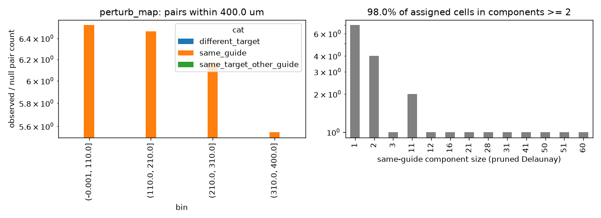

# Same-target clustering: perturb_map

Exploratory (not pre-registered). Generated by scripts/clonality_analysis.py.

## Observed / null pair counts by distance bin

| bin             |   different_target |   same_guide |   same_target_other_guide |
|:----------------|-------------------:|-------------:|--------------------------:|
| (-0.001, 110.0] |                nan |         6.53 |                       nan |
| (110.0, 210.0]  |                nan |         6.47 |                       nan |
| (210.0, 310.0]  |                nan |         6.17 |                       nan |
| (310.0, 400.0]  |                nan |         5.55 |                       nan |

## Same-guide connected components (pruned Delaunay): 98.0% of assigned cells in components of size >= 2

|              |   1 |   2 |   3 |   11 |   12 |   16 |   21 |   28 |   31 |   41 |   50 |   51 |   60 |
|:-------------|----:|----:|----:|-----:|-----:|-----:|-----:|-----:|-----:|-----:|-----:|-----:|-----:|
| n_components |   7 |   4 |   1 |    2 |    1 |    1 |    1 |    1 |    1 |    1 |    1 |    1 |    1 |

## Misassignment signature: {}

