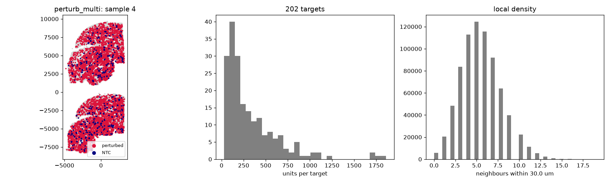

# Audit: perturb_multi

Generated by scripts/audit_datasets.py (Perturb-Multi (MERFISH), units: um).

| metric | value |
|---|---|
| n_units | 750000 |
| n_features | 209 |
| n_samples | 5 |
| guide_call_rate | 0.0954 |
| n_perturbed | 67710 |
| n_ntc | 3828 |
| n_ntc_guides | 50 |
| n_targets | 202 |

## Neighbour graphs and clonality

| graph | mean degree | isolated | median edge | same-target edges obs | null mean (sd) | z |
|---|---|---|---|---|---|---|
| delaunay_pruned | 5.67 | 0.001 | 23.1 | 24856 | 181.0 (14.7) | 1681.7 |
| radius | 5.49 | 0.008 | 21.7 | 26477 | 168.6 (11.0) | 2382.5 |
| knn10 | 11.34 | 0.000 | 30.5 | 37055 | 360.9 (19.3) | 1905.1 |

Local density (neighbours within 30.0 um): perturbed 5.526731649682469, NTC 5.53944618599791, unassigned 5.48.

