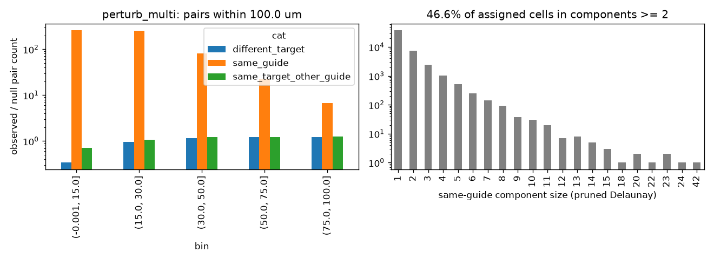

# Same-target clustering: perturb_multi

Exploratory (not pre-registered). Generated by scripts/clonality_analysis.py.

## Observed / null pair counts by distance bin

| bin            |   different_target |   same_guide |   same_target_other_guide |
|:---------------|-------------------:|-------------:|--------------------------:|
| (-0.001, 15.0] |               0.34 |       260.16 |                      0.71 |
| (15.0, 30.0]   |               0.96 |       250.48 |                      1.08 |
| (30.0, 50.0]   |               1.17 |        81.22 |                      1.23 |
| (50.0, 75.0]   |               1.24 |        22.7  |                      1.24 |
| (75.0, 100.0]  |               1.23 |         6.78 |                      1.26 |

## Same-guide connected components (pruned Delaunay): 46.6% of assigned cells in components of size >= 2

|              |     1 |    2 |    3 |    4 |   5 |   6 |   7 |   8 |   9 |   10 |   11 |   12 |   13 |   14 |   15 |   18 |   20 |   22 |   23 |   24 |   42 |
|:-------------|------:|-----:|-----:|-----:|----:|----:|----:|----:|----:|-----:|-----:|-----:|-----:|-----:|-----:|-----:|-----:|-----:|-----:|-----:|-----:|
| n_components | 38231 | 7415 | 2421 | 1007 | 522 | 251 | 142 |  91 |  37 |   30 |   20 |    7 |    8 |    5 |    3 |    1 |    2 |    1 |    2 |    1 |    1 |

## Misassignment signature: {"median_cor": 0.7055790015004464, "n_targets": 60, "frac_cor_above_0.3": 0.95}

