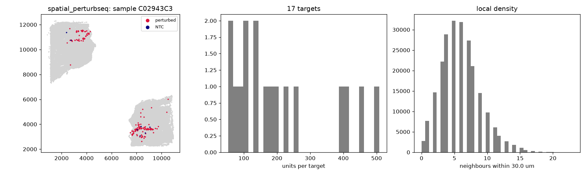

# Audit: spatial_perturbseq

Generated by scripts/audit_datasets.py (Spatial Perturb-seq (Stereo-seq), units: um).

| metric | value |
|---|---|
| n_units | 229775 |
| n_features | 28990 |
| n_samples | 3 |
| guide_call_rate | 0.0207 |
| n_perturbed | 3557 |
| n_ntc | 112 |
| n_ntc_guides | 1 |
| n_targets | 17 |

## Neighbour graphs and clonality

| graph | mean degree | isolated | median edge | same-target edges obs | null mean (sd) | z |
|---|---|---|---|---|---|---|
| delaunay_pruned | 5.72 | 0.001 | 21.8 | 148 | 19.1 (4.2) | 30.8 |
| radius | 5.97 | 0.012 | 21.8 | 157 | 21.2 (4.8) | 28.3 |
| knn10 | 11.23 | 0.000 | 29.3 | 268 | 37.0 (5.6) | 41.5 |

Local density (neighbours within 30.0 um): perturbed 6.018273826258083, NTC 5.866071428571429, unassigned 5.97.

