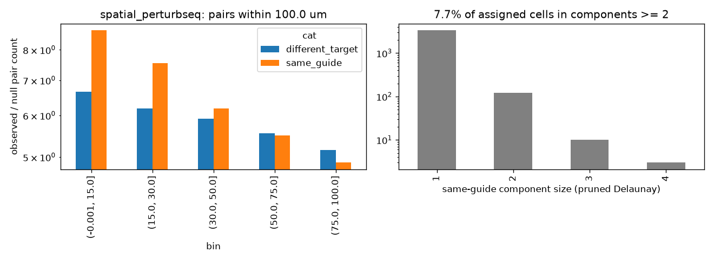

# Same-target clustering: spatial_perturbseq

Exploratory (not pre-registered). Generated by scripts/clonality_analysis.py.

## Observed / null pair counts by distance bin

| bin            |   different_target |   same_guide |
|:---------------|-------------------:|-------------:|
| (-0.001, 15.0] |               6.65 |         8.72 |
| (15.0, 30.0]   |               6.19 |         7.55 |
| (30.0, 50.0]   |               5.92 |         6.18 |
| (50.0, 75.0]   |               5.55 |         5.5  |
| (75.0, 100.0]  |               5.16 |         4.88 |

## Same-guide connected components (pruned Delaunay): 7.7% of assigned cells in components of size >= 2

|              |    1 |   2 |   3 |   4 |
|:-------------|-----:|----:|----:|----:|
| n_components | 3385 | 121 |  10 |   3 |

## Misassignment signature: {"median_cor": 0.16917348769599008, "n_targets": 17, "frac_cor_above_0.3": 0.058823529411764705}

